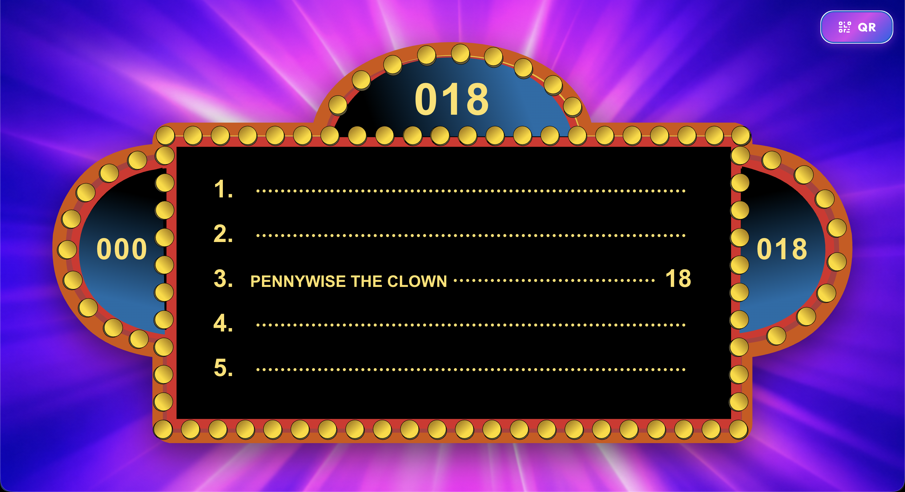
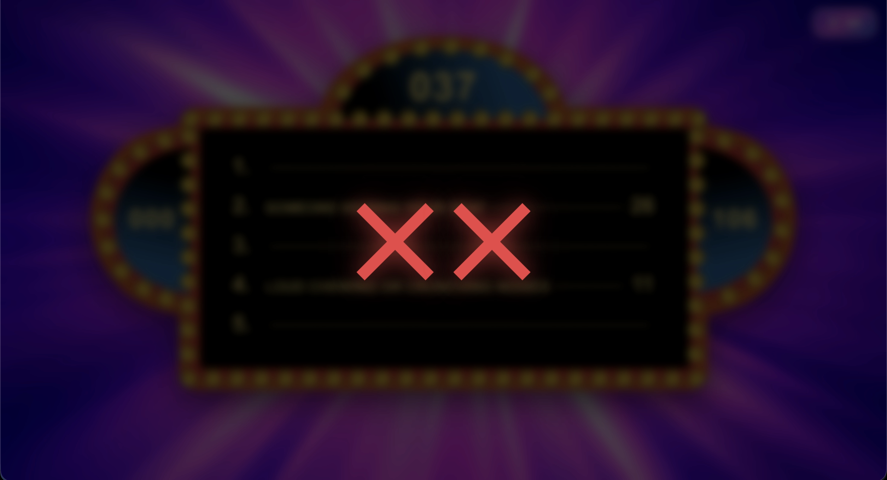
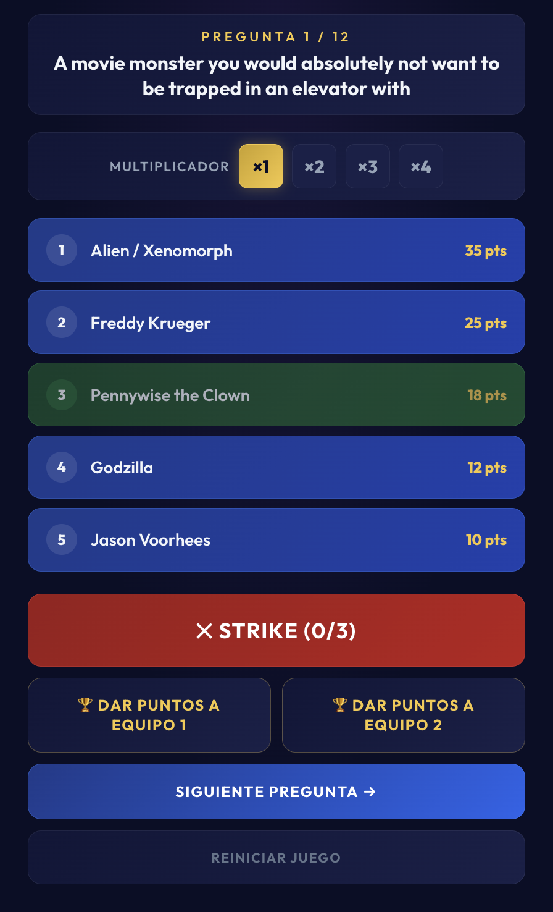
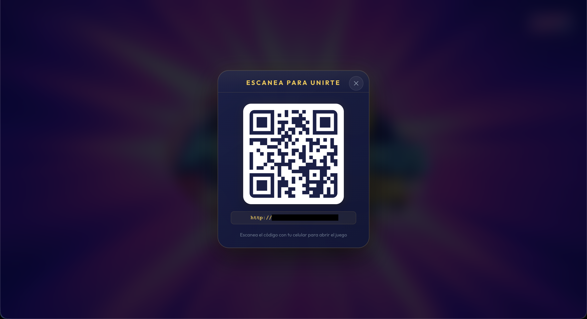

# 100 Mexicanos Dijeron

A web-based recreation of the classic TV game show "100 Mexicanos Dijeron" (Family Feud). Designed for classrooms, parties, and group events, this app runs on a local network so a host computer can display the game board on a projector or TV while players control the game from their phones.


## How It Works

The application is split into two parts: a **board** (displayed on a shared screen) and a **controller** (used from a phone or secondary device). Both communicate in real time through WebSockets over your local network.

1. The host opens the app and displays the **Board** view on a TV or projector.
2. The host uses the controller to reveal answers, give strikes, award points, and advance through questions.

### Board View

The board shows the current question's answer slots, team scores, and round points. When an answer is revealed, it animates into view with a sound effect. Strikes appear as large red X marks overlaid on screen. Scoring triggers a flashing light celebration effect.





### Controller View

The controller is a mobile-friendly interface that shows the current question and lets the host:

- Reveal individual answers
- Add strikes (up to 3 per round)
- Set a point multiplier (1x through 4x)
- Award accumulated round points to either team
- Advance to the next question
- Reset the entire game



### QR Code Sharing

Both the home page and the board page include a QR button in the top-right corner. Clicking it generates a QR code with the local network URL so anyone on the same Wi-Fi can scan it and instantly open the controller on their phone.




## Tech Stack

| Layer    | Technology                          |
|----------|-------------------------------------|
| Frontend | React 19, React Router, Vite       |
| Backend  | Node.js, Express 5, WebSocket (ws) |
| Styling  | Vanilla CSS with custom design tokens |
| Audio    | HTML5 Audio (reveal, strike, points, round start sounds) |

## Project Structure

```
100_mexicanos_dijeron/
├── client/                  # React frontend (Vite)
│   ├── public/              # Static assets (SVGs, images, audio files)
│   └── src/
│       ├── pages/
│       │   ├── Home.jsx     # Landing page with navigation buttons
│       │   ├── Board.jsx    # Game board display (TV/projector)
│       │   └── Control.jsx  # Mobile controller for the host
│       ├── App.jsx          # Router setup
│       ├── index.css        # All styles and design system
│       └── main.jsx         # Entry point
├── server/                  # Node.js backend
│   ├── index.js             # Express + WebSocket server
│   └── data/
│       └── questions.json   # Question bank
├── screenshots/             # Screenshots and demo video
└── package.json             # Root scripts (runs both client and server)
```

## Prerequisites

- Node.js 18 or later
- npm

## Getting Started

1. **Clone the repository**

   ```bash
   git clone https://github.com/Joacimxd/100_mexicanos_dijeron.git
   cd 100_mexicanos_dijeron
   ```

2. **Install dependencies**

   ```bash
   # Root dependencies (concurrently)
   npm install

   # Server dependencies
   cd server && npm install && cd ..

   # Client dependencies
   cd client && npm install && cd ..
   ```

3. **Start the development server**

   ```bash
   npm run dev
   ```

   This launches both the backend (port 3001) and the frontend (port 5173) simultaneously.

4. **Open the app**

   - On the host machine, open `http://localhost:5173` in a browser.
   - Click the Board button to display the game board on a shared screen.
   - Click the QR button or share the network URL (shown in the terminal) so players can open the controller on their phones.

## Customizing Questions

Questions are stored in `server/data/questions.json`. Each question has a text prompt and an array of answers with point values. The format is:

```json
{
  "questions": [
    {
      "question": "Your survey question here",
      "answers": [
        { "text": "Most popular answer", "points": 40 },
        { "text": "Second answer", "points": 25 },
        { "text": "Third answer", "points": 18 },
        { "text": "Fourth answer", "points": 12 },
        { "text": "Fifth answer", "points": 5 }
      ]
    }
  ]
}
```

Edit this file and restart the server to load new questions. Each question can have any number of answers.

## Network Requirements

All devices must be connected to the same local network (Wi-Fi). The server binds to `0.0.0.0` so it is accessible from any device on the network. The client dev server also uses `--host` to expose itself on the LAN.

## License

This project is for educational and personal use.
